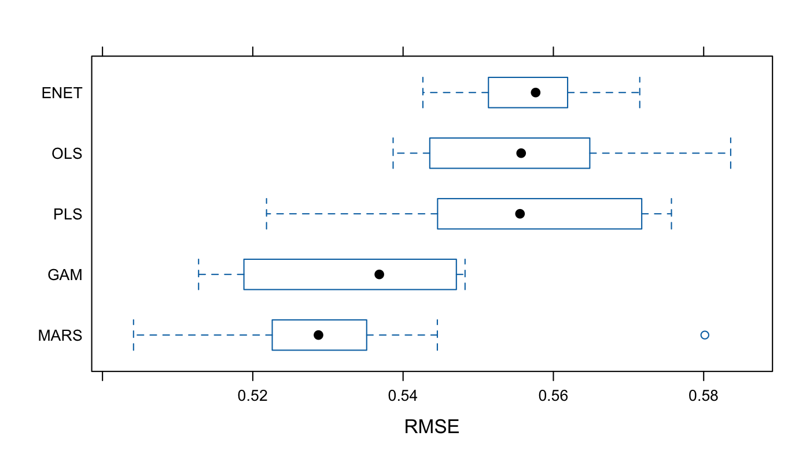
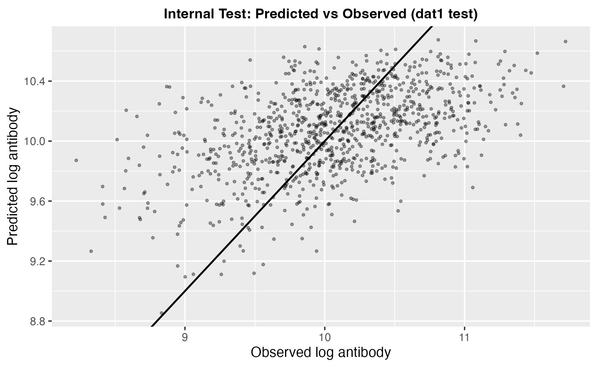
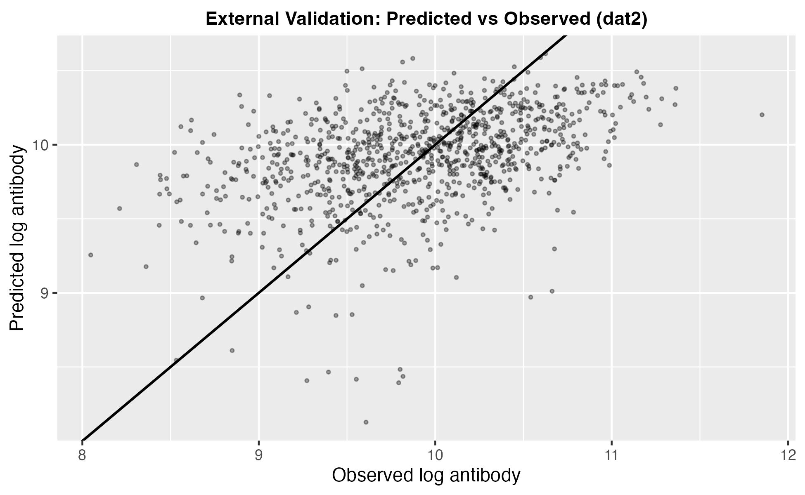
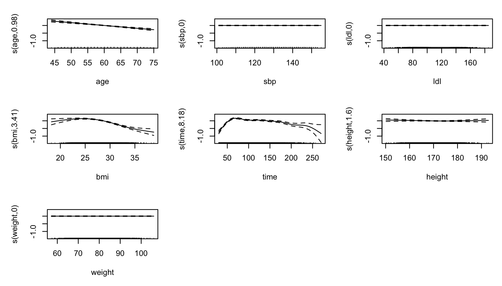

Vaccine-Antibody-Response-Prediction
--Predicting Post-Vaccination Antibody Levels Using Demographic &amp; Clinical Factors

📌 Project Overview
This project develops and validates a predictive model for log-transformed post-vaccination antibody levels using demographic and clinical variables.
Multiple model families were benchmarked, and a final model was selected based on predictive performance and interpretability, with evaluation on an independent external cohort.

🧠 Clinical Question
Can routinely collected demographic and clinical variables be used to predict post-vaccination antibody levels, and does model performance generalize to an independent cohort?

📊 Data
• dat1: Development cohort: used for training (80%) and internal testing (20%)
• dat2: Independent cohort: used exclusively for external validation

Outcome
• Log-transformed antibody level (log_antibody)

Predictors
• Demographics: age, sex, race/ethnicity
• Comorbidities: diabetes, hypertension
• Clinical measures: BMI, systolic blood pressure (SBP), LDL cholesterol
• Time since vaccination
Note: Data are de-identified and not publicly shared.

🔧 Methods

1.Cohort profiling & data quality checks
2.Train/test split with fixed random seed
3.Model benchmarking using 10-fold cross-validation
  • Linear regression
  • Elastic Net
  • Partial Least Squares
  • Generalized Additive Model (GAM)
  • MARS
4.Model selection based on RMSE and interpretability
5.Internal testing (dat1 hold-out)
6.External validation (dat2)
Primary metric: RMSE
Secondary metrics: MAE, R²

📈 Key Results
Model Performance Comparison

Final model was selected based on smallest RMSE, so GAM model performed better than others. 

Calibration Plots

Internal Test (dat1)

External Validation (dat2)

• Internal predictions closely align with the identity line
• External predictions show increased uncertainty with mild underestimation at higher antibody levels
• Overall linear association is preserved, indicating reasonable transportability

Model Interpretability

The final GAM model captures non-linear relationships between antibody levels and key predictors such as:
• Age
• BMI
• Time since vaccination

⚠️ Limitations

• Observational design (no causal interpretation)
• Potential cohort shift between development and validation cohorts
• Extreme antibody values show higher prediction uncertainty